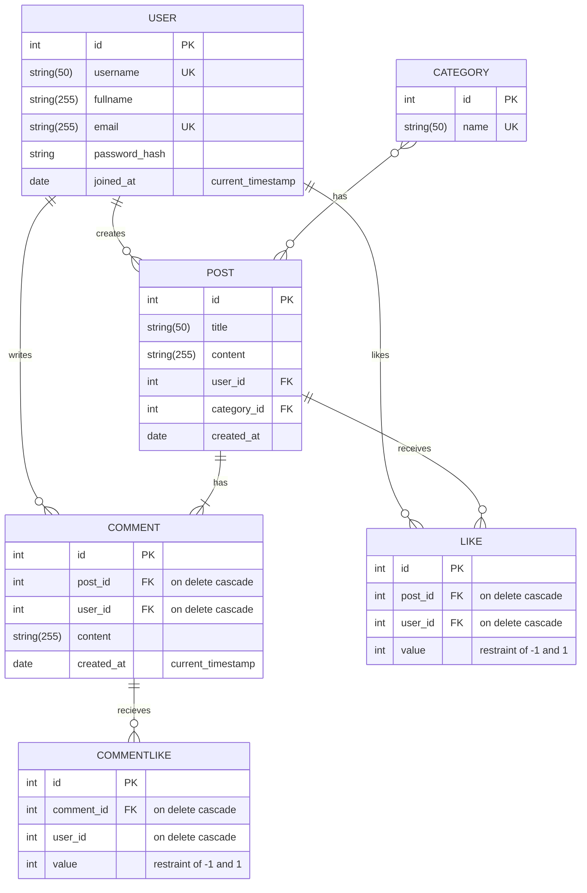

```mermaid
erDiagram
    USER ||--o{ POST : creates
    USER ||--o{ COMMENT : writes
    USER ||--o{ LIKE : "likes"
    POST ||--|{ COMMENT : has
    POST ||--o{ LIKE : "receives"
    CATEGORY }o--o{ POST : has
    COMMENT ||--o{ COMMENTLIKE : "recieves"
    POST {
        int id PK
        string(50) title
        string(255) content
        int user_id FK
        int category_id FK
        date created_at
    }
    USER {
        int id PK
        string(50) username UK
        string(255) fullname
        string(255) email UK
        string password_hash
        date joined_at "current_timestamp"
    }
    CATEGORY {
        int id PK
        string(50) name UK
    }
    COMMENT {
        int id PK
        int post_id FK "on delete cascade"
        int user_id FK "on delete cascade"
        string(255) content
        date created_at "current_timestamp"
    }
    LIKE {
        int id PK
        int post_id FK "on delete cascade"
        int user_id FK "on delete cascade"
        int value "restraint of -1 and 1"
    }
    COMMENTLIKE {
        int id PK
        int comment_id FK "on delete cascade"
        int user_id "on delete cascade"
        int value "restraint of -1 and 1"
    }
```
